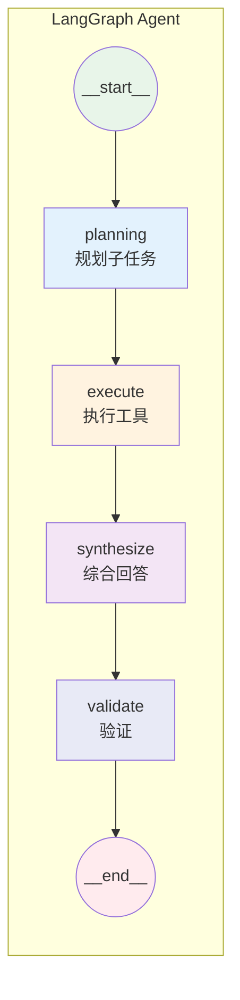

# Agent 图结构说明

本文档帮助理解 `src/lib/agent/agent-graph.ts` 中的 LangGraph 结构。

## 流程图



## 核心概念

### 1. StateGraph（状态图）

LangGraph 用 **StateGraph** 定义「状态机」：每个节点接收当前状态，返回状态更新，图按边顺序执行。

```ts
const graph = new StateGraph(AgentState)  // 状态定义在 state.ts
  .addNode("planning", planNode)          // 节点 = 函数
  .addEdge("__start__", "planning")      // 边 = 流转方向
  .addEdge("planning", "execute")
  // ...
  .addEdge("validate", END);

return graph.compile();  // 编译成可执行的 CompiledGraph
```

### 2. 状态（State）

在 `state.ts` 中定义，所有节点共享同一份状态，通过返回值**合并更新**：

| 字段 | 说明 |
|------|------|
| `userMessage` | 用户问题 |
| `plan` | 规划结果（子任务列表） |
| `toolResults` | 各工具执行结果，key 为 sub_task.id |
| `finalAnswer` | 最终回答 |
| `completedSteps` | 已完成的步骤 |

### 3. 各节点职责

| 节点 | 输入 | 输出 | 说明 |
|------|------|------|------|
| **planning** | userMessage, tableSchemas, enableKnowledge/Query | plan (sub_tasks) | 先按 router 规则路由；forceSearchOnly 时跳过 LLM 直接生成单任务；否则 LLM 拆解，再 applyRouteRules 修正 |
| **execute** | plan, toolResults | toolResults | 按依赖顺序执行子任务；execute_query 失败或无 sql 时 fallback 到 search_knowledge |
| **synthesize** | toolResults | finalAnswer | 用 LLM 合并所有工具结果，生成最终回答 |
| **validate** | finalAnswer, plan | - | 规则检查（当前为占位，可扩展） |

### 4. 路由规则（router.ts）

基于 prompt 规则显式编排，不依赖 LLM 判断：

| 规则 | 实现 |
|------|------|
| Schema 无销量/产品相关表 | forceSearchOnly → 直接 search_knowledge，跳过 LLM |
| 销量+说明类问题 | preferSearchFirst → 子任务顺序 search 优先 |
| execute_query 失败/无 sql | execute 节点内 fallback 到 search_knowledge |

### 5. 跨工具数据传递

当子任务有 `depends_on: ["st1"]` 时，execute 会：

1. 从 `toolResults["st1"]` 取前序结果
2. 用 `extractInjectContext()` 提取关键文本（如 "产品A"）
3. 拼接到当前 query：`"产品A 产品说明"`

例如：「销量最高的产品及其说明」→ st1 查 SQL 得产品 A → st2 用 "产品A 说明" 搜知识库。

## 与 streamText 的区别

| 对比项 | streamText (Phase 1) | LangGraph Agent (Phase 2) |
|--------|----------------------|---------------------------|
| 编排方式 | LLM 自主决定调用顺序 | 显式 plan → execute 流程 |
| 跨工具传参 | 依赖 LLM 理解上下文 | 通过 depends_on + inject 显式传递 |
| 适用场景 | 简单/中等问题 | 复杂多步骤问题 |

## 相关文件

| 文件 | 说明 |
|------|------|
| `agent-graph.ts` | 图构建与节点实现 |
| `router.ts` | 数据来源路由（Schema 判断、工具选择） |
| `state.ts` | 状态定义 |
| `prompts.ts` | plan / synthesize 提示词 |
| `tools.ts` | agentSearchKnowledge、agentExecuteQuery |
| `stream-adapter.ts` | Agent 输出 → useChat 流式响应 |
