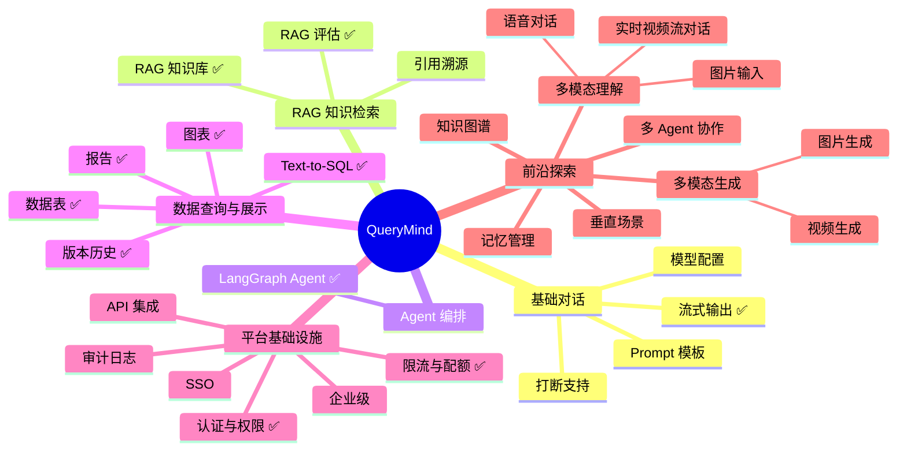

# QueryMind 产品能力文档

> AI 驱动的自然语言数据与知识助手。本文档梳理当前能力与未来规划。

---

## 一、产品概览

| 维度         | 说明                                                     |
| ------------ | -------------------------------------------------------- |
| **产品名**   | QueryMind                                                |
| **定位**     | 自然语言问答：数据查询 + 知识检索 + 报告生成             |
| **核心价值** | 用户用自然语言提问，获得表格、图表、知识回答、结构化报告 |

---

## 二、QueryMind 开发规划

### 能力总览（思维导图）

**快速跳转**：[基础对话](#一基础-llm-对话) · [RAG 知识库](#rag-知识库) · [RAG 评估](#rag-应用评估) · [Agent](#langgraph-agent) · [Text-to-SQL](#text-to-sql) · [数据表](#数据表excelcsv) · [图表](#图表与可视化) · [报告](#报告生成) · [多模态理解](#多模态理解) · [多模态生成](#多模态生成) · [认证与权限](#认证与权限) · [限流](#限流与配额)

---

### 一、基础 LLM 对话

#### 流式输出

| 能力       | 重要度 | 是否已实现 | 说明                           |
| ---------- | ------ | ---------- | ------------------------------ |
| 对话流式   | ★★★★★  | ✅         | streamText + useChat，逐字输出 |
| 打断支持   | ★★★☆☆  | ❌         | 用户可中断生成                 |
| 低延迟优化 | ★★★☆☆  | ❌         | 首 token 延迟、缓存策略        |

---

#### 模型配置

| 能力          | 重要度 | 是否已实现 | 说明                              |
| ------------- | ------ | ---------- | --------------------------------- |
| 模型切换      | ★★★★☆  | ❌         | 多模型选择（DashScope/OpenAI 等） |
| 参数配置      | ★★★★☆  | ❌         | 温度、top_p、max_tokens           |
| 按 space 配置 | ★★★☆☆  | ❌         | 不同空间不同模型/参数             |

---

### 二、RAG 知识检索

#### RAG 知识库

> 格式解析、向量检索、Self-Query、置信度路由、Rerank、Multi-Query 等。  
> **详细内容**：→ [RAG 检索优化（索引、预检索、检索、后检索、生成五阶段）](RAG_RETRIEVAL_OPTIMIZATION.md)

| 能力       | 重要度 | 是否已实现 | 说明                                      |
| ---------- | ------ | ---------- | ----------------------------------------- |
| 格式解析   | ★★★★★  | ✅         | PDF/Word/TXT 解析、chunk 切分             |
| 向量检索   | ★★★★★  | ✅         | 向量索引、相似度检索                      |
| Self-Query | ★★★★☆  | ✅         | 自然语言 → 结构化查询                    |
| Rerank     | ★★★★☆  | ✅         | 检索结果重排序                            |
| Multi-Query| ★★★☆☆  | ✅         | 多查询扩展                                |
| 引用溯源   | ★★★★☆  | ❌         | chunk 高亮、可点击跳转，答案可追溯        |

---

#### RAG 应用评估

> 建立 RAG 质量评估体系，实现「可度量、可优化、可闭环」。
> **详细内容**：→ [RAG 评估文档（指标体系、RAGAS、实施指南）](RAG_EVALUATION.md)

| 能力           | 重要度 | 是否已实现 | 说明                                                              |
| -------------- | ------ | ---------- | ----------------------------------------------------------------- |
| 指标体系       | ★★★★★  | ✅         | Faithfulness、Answer Relevancy、Context Precision、Context Recall |
| TS 评估库      | ★★★★★  | ✅         | RAGAS 方法论自写实现，DashScope 集成                              |
| 评估数据集     | ★★★★★  | ✅         | 内置 sample.json + e2e.json                                       |
| 自动化基准测试 | ★★★★☆  | ✅         | CLI 工具，支持标准 + E2E 模式                                     |
| 评估看板       | ★★★☆☆  | ✅         | `/eval` 页面：分数卡片 + 趋势折线图 + 历史表格                    |
| 自动化定时评估 | ★★★☆☆  | ✅         | GitHub Actions Cron 每天 8:00/20:00 自动评估                      |
| 用户反馈闭环   | ★★★★☆  | ❌         | 点赞/点踩 + 反馈落库，与评估数据关联                              |

**下一步**：用户反馈闭环、BM25 混合检索提升 Context Precision、扩充评估样本。

---

#### 跨模态检索

| 能力            | 重要度 | 是否已实现 | 说明                         |
| --------------- | ------ | ---------- | ---------------------------- |
| 知识库+数据联动 | ★★★★★  | ❌         | 知识库 + 结构化数据联动回答  |
| 实时数据接入    | ★★★★☆  | ❌         | API、数据库直连，接入 BI/ERP |
| 知识图谱        | ★★★☆☆  | ❌         | 实体关系、推理式问答         |

---

### 三、Agent 智能编排

#### LangGraph Agent

| 能力          | 重要度 | 是否已实现 | 说明                                                                 |
| ------------- | ------ | ---------- | -------------------------------------------------------------------- |
| 多步推理      | ★★★★★  | ✅         | LangGraph plan → execute → synthesize，复杂问题拆解为子任务          |
| 自主规划      | ★★★★★  | ✅         | planning 节点 LLM 拆解 + router 规则路由（Schema/search 显式编排）   |
| 工具链编排    | ★★★★★  | ✅         | search_knowledge + execute_query 按依赖执行，depends_on 跨工具传参   |
| 记忆管理      | ★★★★☆  | ❌         | 工作记忆 + 外部记忆（向量库、知识图谱）                             |
| 多 Agent 协作 | ★★★☆☆  | ❌         | 专家 Agent 集群分工                                                 |

**已实现**：复杂度分类（classify）→ 复杂问题走 LangGraph Agent；规则路由（router.ts）；execute 失败 fallback；AgentProgress 进度展示。详见 [Agent 图结构](AGENT_GRAPH.md)。

---

### 四、数据查询

#### Text-to-SQL

| 能力               | 重要度 | 是否已实现 | 说明                                 |
| ------------------ | ------ | ---------- | ------------------------------------ |
| Schema 注入        | ★★★★★  | ✅         | 表 DDL 注入系统提示，供 AI 生成 SQL  |
| 只读执行           | ★★★★★  | ✅         | 仅 SELECT，驱动层拒绝写操作          |
| SQL 前缀校验       | ★★★★★  | ✅         | 非 SELECT、分号拼接直接拒绝          |
| 数据源             | ★★★★★  | ✅         | PostgreSQL ud\_\* 表，Excel/CSV 建表 |
| 自愈重试           | ★★★★☆  | ✅         | SQL 报错回传 AI，自动修正重试        |
| 两阶段 Schema 注入 | ★★★★☆  | ❌         | 表多时先选相关表再注入，省 token     |
| 多数据库支持       | ★★★☆☆  | ❌         | MySQL、PostgreSQL 等                 |

**下一步**：两阶段 Schema 注入、多数据库支持。

---

#### 数据表（Excel/CSV）

| 能力         | 重要度 | 是否已实现 | 说明                   |
| ------------ | ------ | ---------- | ---------------------- |
| 解析/建表    | ★★★★★  | ✅         | xlsx 解析，ud\_\* 建表 |
| Schema 注入  | ★★★★★  | ✅         | 供 Text-to-SQL 使用    |
| 实时数据接入 | ★★★★☆  | ❌         | API、数据库直连        |
| 多数据源     | ★★★☆☆  | ❌         | 多库/多表联合          |

**下一步**：实时数据接入、多数据源。

---

### 五、可视化

#### 图表与可视化

| 能力             | 重要度 | 是否已实现 | 说明             |
| ---------------- | ------ | ---------- | ---------------- |
| 图表类型         | ★★★★☆  | ✅         | bar/line/pie     |
| show_chart       | ★★★★☆  | ✅         | 直接展示         |
| suggest_chart    | ★★★☆☆  | ✅         | 建议后用户确认   |
| groupKey/响应式  | ★★★☆☆  | ✅         | 多系列、适配屏幕 |
| 图表导出         | ★★★☆☆  | ❌         | PNG/PDF          |
| 自然语言到可视化 | ★★★☆☆  | ❌         | AI 推荐图表类型  |

**下一步**：图表导出、更多图表类型、自然语言推荐。

---

### 六、报告

#### 报告生成

| 能力     | 重要度 | 是否已实现 | 说明                               |
| -------- | ------ | ---------- | ---------------------------------- |
| 报告模式 | ★★★★★  | ✅         | reportId 或「报告」关键词激活      |
| 章节类型 | ★★★★★  | ✅         | markdown/chart/table               |
| 编辑流程 | ★★★★☆  | ✅         | LangGraph Plan→Query→Analyze→Write |
| 导出     | ★★★★☆  | ✅         | PDF/Word 客户端导出                |
| 报告协作 | ★★★★☆  | ❌         | 多人编辑、评论、@、审批流          |
| 版本历史 | ★★★☆☆  | ✅         | 查看与恢复                         |

**下一步**：报告协作、报告模板、审批流。

---

### 七、认证与权限

#### 认证与权限

| 能力     | 重要度 | 是否已实现 | 说明                        |
| -------- | ------ | ---------- | --------------------------- |
| 认证     | ★★★★★  | ✅         | JWT + bcrypt + session 7 天 |
| 用户类型 | ★★★★☆  | ✅         | 匿名/个人/企业              |
| 空间角色 | ★★★★☆  | ✅         | admin/editor/viewer         |
| 租户     | ★★★☆☆  | ✅         | tenant → spaces → members   |
| 加入申请 | ★★★☆☆  | ✅         | 审批流程                    |
| SSO      | ★★★☆☆  | ❌         | 单点登录                    |
| 审计日志 | ★★★☆☆  | ❌         | 操作日志、数据溯源          |

**下一步**：SSO、审计日志、细粒度权限。

---

### 八、基础设施

#### 限流与配额

| 能力       | 重要度 | 是否已实现 | 说明                       |
| ---------- | ------ | ---------- | -------------------------- |
| 限流与配额 | ★★★★★  | ✅         | 按用户类型差异化（见下表） |
| 计费       | ★★★☆☆  | ❌         | 按 token/存储计费          |

| 维度       | 匿名  | 个人  | 企业   |
| ---------- | ----- | ----- | ------ |
| 文件上限   | 0     | 10    | 50     |
| 聊天/分钟  | 10    | 20    | 30     |
| 上传/分钟  | 0     | 3     | 10     |
| 每日 token | 10 万 | 20 万 | 100 万 |

---

#### 企业级

| 能力       | 重要度 | 是否已实现 | 说明                |
| ---------- | ------ | ---------- | ------------------- |
| 私有化部署 | ★★★★★  | ❌         | On-Premise、VPC     |
| 审计与合规 | ★★★★☆  | ❌         | 操作日志、数据溯源  |
| 可定制性   | ★★★★☆  | ❌         | 自定义 Prompt、模型 |
| 计费与配额 | ★★★☆☆  | ❌         | 按 token/存储计费   |

---

### 九、扩展能力

#### 多模态理解与交互

> 输入侧：理解图片、语音、视频；交互侧：语音对话、视频流对话。

| 能力              | 重要度 | 是否已实现 | 说明                               |
| ----------------- | ------ | ---------- | ---------------------------------- |
| 图片输入          | ★★★★★  | ❌         | 图表、截图、设计稿理解             |
| 表格/文档理解     | ★★★★☆  | ❌         | PDF 表格、Excel 视觉解析           |
| 跨模态检索        | ★★★★☆  | ❌         | 文本 + 图像联合检索                 |
| 语音输入          | ★★★☆☆  | ❌         | 语音转文字 + 理解                   |
| **语音对话**      | ★★★★☆  | ❌         | 语音输入 + TTS 输出，实时语音交互   |
| **实时视频流对话**| ★★★☆☆  | ❌         | 视频流输入/输出，实时视频对话       |

---

#### 多模态生成（AIGC）

> 输出侧：文生图、文生视频。

| 能力        | 重要度 | 是否已实现 | 说明                     |
| ----------- | ------ | ---------- | ------------------------ |
| **图片生成**| ★★★★☆  | ❌         | 文生图，支持对话中生成   |
| **视频生成**| ★★★☆☆  | ❌         | 文生视频，支持对话中生成 |

---

#### 协作

| 能力     | 重要度 | 是否已实现 | 说明                 |
| -------- | ------ | ---------- | -------------------- |
| 报告协作 | ★★★★☆  | ❌         | 多人编辑、评论、@    |
| 知识共享 | ★★★☆☆  | ❌         | 报告模板、常用问题库 |
| 人机协作 | ★★★☆☆  | ❌         | AI 草稿 + 人工润色   |

---

#### 体验

| 能力             | 重要度 | 是否已实现 | 说明                  |
| ---------------- | ------ | ---------- | --------------------- |
| 对话式 BI        | ★★★★☆  | ❌         | 追问、钻取、下钻      |
| 个性化记忆       | ★★★★☆  | ❌         | 记住偏好、术语、历史  |
| 主动洞察         | ★★★☆☆  | ❌         | 被动 → 主动，异常推送 |
| 自然语言到可视化 | ★★★☆☆  | ❌         | AI 推荐图表类型       |
| 低代码扩展       | ★★★☆☆  | ❌         | 自定义工具、插件市场  |

---

#### API/集成

| 能力     | 重要度 | 是否已实现 | 说明                   |
| -------- | ------ | ---------- | ---------------------- |
| 对外 API | ★★★★☆  | ❌         | REST API、API Key 鉴权 |
| Webhook  | ★★★☆☆  | ❌         | 事件回调、通知         |
| 嵌入集成 | ★★★☆☆  | ❌         | Slack、企微、飞书嵌入  |

---

#### 其他

| 能力        | 重要度 | 是否已实现 | 说明                  |
| ----------- | ------ | ---------- | --------------------- |
| 垂直场景    | ★★★★☆  | ❌         | 金融、医疗、教育适配  |
| 多语言      | ★★★☆☆  | ❌         | 界面+回答+检索多语言  |
| 移动端/嵌入 | ★★★☆☆  | ❌         | Slack、企微、飞书嵌入 |
| 开源生态    | ★★☆☆☆  | ❌         | 插件 SDK、社区贡献    |

---

### 实施路线图

| 阶段               | 建议动作                                                      | 对应模块         |
| ------------------ | ------------------------------------------------------------- | ---------------- |
| **短期（1–2 月）** | BM25 混合检索、两阶段 Schema 注入、用户反馈闭环               | RAG、Text-to-SQL |
| **中期（3–6 月）** | 报告协作（评论、@）、跨模态检索、引用溯源                     | 报告、RAG+数据表 |
| **长期（6 月+）**  | 记忆管理、多 Agent 协作、多模态理解、语音/视频对话、图片/视频生成、私有化部署 | Agent、多模态、企业级 |

---

### 战略方向：2026 前沿 + 未来潜力（按优先级）

> 将 2026 前沿方向与未来高潜力方向统一纳入战略规划，按 P0→P1→P2 优先级排序，与现有模块对齐。

#### P0 级战略方向

| 方向               | 优先级 | 说明                                                               | 对应模块               |
| ------------------ | ------ | ------------------------------------------------------------------ | ---------------------- |
| **推理与规划**     | P0     | CoT/ToT、ReAct、Planning-and-Solve，从对话工具向自主执行智能体演进 | Agentic 工作流         |
| **多模态原生融合** | P0     | 文本+图像+表格+语音统一处理，跨模态检索与理解                      | 多模态理解、跨模态检索 |

> RAG 相关战略（Agentic RAG、混合检索、Enrich、GraphRAG 等）→ [RAG 检索优化 · 进阶](RAG_RETRIEVAL_OPTIMIZATION.md#进阶战略方向)

#### P1 级战略方向

| 方向                        | 优先级 | 说明                                                                | 对应模块             |
| --------------------------- | ------ | ------------------------------------------------------------------- | -------------------- |
| **多 Agent 协作**           | P1     | 专家 Agent 集群（研究员、编程员、评审员）分工协作，提升复杂任务效率 | Agentic 工作流       |
| **垂直领域深度定制**        | P1     | 金融、医疗、教育等场景的领域模型、术语、评估与合规适配              | 其他、商业化         |
| **具身智能 / 人机协作**     | P1     | AI 草稿 + 人工润色，人机混合工作流，而非全自动替代                  | 协作、体验           |
| **AI 治理与可解释性**       | P1     | 机械可解释性研究、RAGAS 等评估体系，降低幻觉与黑盒风险              | RAG 评估、审计日志   |

#### P2 级战略方向

| 方向                  | 优先级 | 说明                                                             | 对应模块           |
| --------------------- | ------ | ---------------------------------------------------------------- | ------------------ |
| **小模型与边缘部署**  | P2     | 量化、剪枝、蒸馏，垂直领域小模型性能逼近大模型，低成本私有化     | 企业级、私有化部署 |
| **实时流式推理**      | P2     | 低延迟、支持打断与多轮对话的流式响应                             | 体验、对话式 BI    |
| **AI 原生应用**       | P2     | 以 AI 为第一交互范式重构产品，而非在传统 UI 上叠加聊天           | 产品形态革新       |
| **Voice-First**       | P2     | 语音优先设计：低延迟、打断处理、多通道无缝切换，客服等场景主战场 | 多模态、体验       |
| **自主进化（RLAIF）** | P2     | 基于 AI 反馈的强化学习，模型自优化，减少人工标注                 | 长期研发效率       |

---

_文档更新于 2026 年 3 月_
