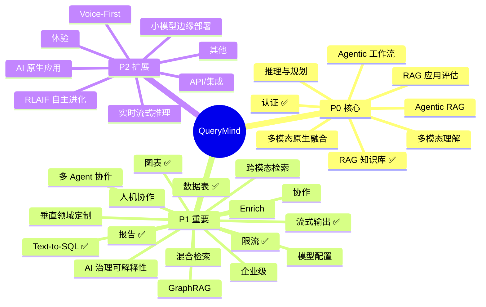

# QueryMind 产品能力文档

> AI 驱动的自然语言数据与知识助手。本文档梳理当前能力与未来规划。

---

## 一、产品概览

| 维度         | 说明                                                     |
| ------------ | -------------------------------------------------------- |
| **产品名**   | QueryMind                                                |
| **定位**     | 自然语言问答：数据查询 + 知识检索 + 报告生成             |
| **核心价值** | 用户用自然语言提问，获得表格、图表、知识回答、结构化报告 |

---

## 二、QueryMind 开发规划

### 模块结构概览

| 模块                          | 状态      | 说明                                    |
| ----------------------------- | --------- | --------------------------------------- |
| [RAG 知识库](#rag-知识库)     | ✅ 已实现 | 格式/解析/检索/Rerank 等核心能力        |
| [RAG 应用评估](#rag-应用评估) | 待实现    | 检索/生成质量评估、基准测试、闭环优化   |
| [引用溯源](#rag-知识库)       | 待实现    | chunk 高亮、可点击跳转，答案可追溯      |
| [认证](#认证与权限)           | ✅ 已实现 | JWT、用户类型、空间角色、租户           |
| [报告](#报告生成)             | ✅ 已实现 | 报告模式、章节、编辑流程、导出          |
| [跨模态检索](#跨模态检索)     | 待实现    | 知识库+数据联动、实时接入、知识图谱     |
| [图表](#图表与可视化)         | ✅ 已实现 | bar/line/pie、show_chart、suggest_chart |
| [Text-to-SQL](#text-to-sql)   | ✅ 已实现 | Schema 注入、只读执行、自愈重试         |
| [数据表](#数据表)             | ✅ 已实现 | 解析建表、Schema 注入                   |
| [协作](#协作)                 | 待实现    | 报告协作、知识共享、人机协作            |
| [限流](#限流与配额)           | ✅ 已实现 | 按用户类型差异化配额                    |
| [企业级](#企业级)             | 待实现    | 私有化部署、审计合规、可定制            |
| [体验](#体验)                 | 待实现    | 对话式 BI、个性化记忆、主动洞察         |
| [流式输出](#流式输出)         | ✅ 已实现 | streamText + useChat，对话流式响应      |
| [模型配置](#模型配置)         | 待实现    | 多模型切换、温度/参数、可定制           |
| [API/集成](#api集成)          | 待实现    | 对外 API、Webhook、嵌入（Slack/企微）   |
| [其他](#其他)                 | 待实现    | 垂直场景、多语言、嵌入、开源生态        |

**快速跳转**：[RAG 知识库](#rag-知识库) · [RAG 应用评估](#rag-应用评估) · [引用溯源](#rag-知识库) · [Agentic 工作流](#agentic-工作流) · [多模态理解](#多模态理解) · [认证](#认证与权限) · [报告](#报告生成) · [跨模态检索](#跨模态检索) · [图表](#图表与可视化) · [Text-to-SQL](#text-to-sql) · [数据表](#数据表) · [协作](#协作) · [限流](#限流与配额) · [企业级](#企业级) · [体验](#体验) · [流式输出](#流式输出) · [模型配置](#模型配置) · [API/集成](#api集成) · [其他](#其他)

---

### P0 核心模块

#### RAG 知识库 【P0】

| 能力                  | 重要度 | 是否已实现 | 说明                                         |
| --------------------- | ------ | ---------- | -------------------------------------------- |
| 格式支持              | ★★★★★  | ✅         | .txt/.md/.pdf/.docx，20MB                    |
| PDF 解析              | ★★★★★  | ✅         | 本地 pdf-parse + LlamaParse 云               |
| 多分块策略            | ★★★★★  | ✅         | standard/parentChild/semantic                |
| 向量检索              | ★★★★★  | ✅         | pgvector + DashScope 1024 维                 |
| Self-Query            | ★★★★★  | ✅         | 解析 query + filterTitle，「XX 文档里的 YY」 |
| 空间隔离              | ★★★★★  | ✅         | 文档按 space_id 存储                         |
| BM25 + 向量混合       | ★★★★★  | ❌         | tsvector + RRF 融合，提升关键词召回          |
| DOCX 解析             | ★★★★☆  | ✅         | mammoth + LlamaParse                         |
| 智能模式              | ★★★★☆  | ✅         | 本地优先，复杂版式回退云                     |
| filter 回退           | ★★★★☆  | ✅         | filter 无结果时重试无 filter                 |
| 置信度路由            | ★★★★☆  | ✅         | score_gap/std 决定 top10/rerank/multi-query  |
| Rerank                | ★★★★☆  | ✅         | Cohere rerank（可选）                        |
| Multi-Query           | ★★★★☆  | ✅         | 2–4 个 query 变体检索合并                    |
| Parent-Child 去重     | ★★★★☆  | ✅         | 按父块去重，返回父块内容                     |
| Query 扩展            | ★★★★☆  | ❌         | 多轮对话历史扩展 query                       |
| Enrich（意图+结构化） | ★★★★☆  | ❌         | 意图路由（是否检索）+ 结构化 filter 提取     |
| 引用溯源              | ★★★★☆  | ❌         | chunk 高亮、可点击跳转                       |
| 图片处理              | ★★★☆☆  | ✅         | LlamaParse 图片上传 Supabase                 |
| title 匹配增强        | ★★★☆☆  | ✅         | title + metadata.filename，支持 base name    |
| 高置信/摘要索引       | ★★★☆☆  | ✅         | 直接 top-10 / 嵌入摘要                       |
| 同名覆盖              | ★★★☆☆  | ✅         | 同 space+title 覆盖                          |
| LlamaParse 档位       | ★★☆☆☆  | ✅         | fast/cost_effective/agentic 按复杂度选择     |

**下一步**：BM25 混合、Query 扩展、Enrich（意图路由+结构化）、引用溯源。RAG 应用评估见下节，RAG Pipeline 详见第四章。

---

#### RAG 应用评估 【P0】

> 建立 RAG 质量评估体系，实现「可度量、可优化、可闭环」。无评估则无法判断检索与生成质量，难以持续改进。  
> **详细内容**：→ [RAG 评估文档（指标体系、RAGAS、实施指南）](RAG_EVALUATION.md)

---

#### Agentic 工作流 【P0】

| 能力          | 重要度 | 是否已实现 | 说明                                    |
| ------------- | ------ | ---------- | --------------------------------------- |
| 多步推理      | ★★★★★  | ❌         | CoT/ToT，拆解模糊指令为可执行步骤       |
| 自主规划      | ★★★★★  | ❌         | Planning-and-Solve、ReAct 模式          |
| 工具链编排    | ★★★★★  | ❌         | 自主调用 SQL、RAG、图表等工具           |
| 记忆管理      | ★★★★☆  | ❌         | 工作记忆 + 外部记忆（向量库、知识图谱） |
| 多 Agent 协作 | ★★★☆☆  | ❌         | 专家 Agent 集群分工                     |

**下一步**：ReAct 模式、工具链编排、记忆管理。

---

#### 多模态理解 【P0】

| 能力          | 重要度 | 是否已实现 | 说明                     |
| ------------- | ------ | ---------- | ------------------------ |
| 图片输入      | ★★★★★  | ❌         | 图表、截图、设计稿理解   |
| 表格/文档理解 | ★★★★☆  | ❌         | PDF 表格、Excel 视觉解析 |
| 跨模态检索    | ★★★★☆  | ❌         | 文本 + 图像联合检索      |
| 语音输入      | ★★★☆☆  | ❌         | 语音转文字 + 理解        |

**下一步**：图片输入、表格理解、跨模态检索。

---

#### 认证与权限 【P0】

| 能力     | 重要度 | 是否已实现 | 说明                        |
| -------- | ------ | ---------- | --------------------------- |
| 认证     | ★★★★★  | ✅         | JWT + bcrypt + session 7 天 |
| 用户类型 | ★★★★☆  | ✅         | 匿名/个人/企业              |
| 空间角色 | ★★★★☆  | ✅         | admin/editor/viewer         |
| 租户     | ★★★☆☆  | ✅         | tenant → spaces → members   |
| 加入申请 | ★★★☆☆  | ✅         | 审批流程                    |
| SSO      | ★★★☆☆  | ❌         | 单点登录                    |
| 审计日志 | ★★★☆☆  | ❌         | 操作日志、数据溯源          |

**下一步**：SSO、审计日志、细粒度权限。

---

### P1 重要模块

#### 报告生成 【P1】

| 能力     | 重要度 | 是否已实现 | 说明                               |
| -------- | ------ | ---------- | ---------------------------------- |
| 报告模式 | ★★★★★  | ✅         | reportId 或「报告」关键词激活      |
| 章节类型 | ★★★★★  | ✅         | markdown/chart/table               |
| 编辑流程 | ★★★★☆  | ✅         | LangGraph Plan→Query→Analyze→Write |
| 导出     | ★★★★☆  | ✅         | PDF/Word 客户端导出                |
| 报告协作 | ★★★★☆  | ❌         | 多人编辑、评论、@、审批流          |
| 版本历史 | ★★★☆☆  | ✅         | 查看与恢复                         |

**下一步**：报告协作、报告模板、审批流。

---

#### 跨模态检索 【P1】

| 能力            | 重要度 | 是否已实现 | 说明                         |
| --------------- | ------ | ---------- | ---------------------------- |
| 知识库+数据联动 | ★★★★★  | ❌         | 知识库 + 结构化数据联动回答  |
| 实时数据接入    | ★★★★☆  | ❌         | API、数据库直连，接入 BI/ERP |
| 知识图谱        | ★★★☆☆  | ❌         | 实体关系、推理式问答         |

**下一步**：知识库与数据表联动、实时数据接入。

---

#### 图表与可视化 【P1】

| 能力             | 重要度 | 是否已实现 | 说明             |
| ---------------- | ------ | ---------- | ---------------- |
| 图表类型         | ★★★★☆  | ✅         | bar/line/pie     |
| show_chart       | ★★★★☆  | ✅         | 直接展示         |
| suggest_chart    | ★★★☆☆  | ✅         | 建议后用户确认   |
| groupKey/响应式  | ★★★☆☆  | ✅         | 多系列、适配屏幕 |
| 图表导出         | ★★★☆☆  | ❌         | PNG/PDF          |
| 自然语言到可视化 | ★★★☆☆  | ❌         | AI 推荐图表类型  |

**下一步**：图表导出、更多图表类型、自然语言推荐。

---

#### Text-to-SQL 【P1】

| 能力               | 重要度 | 是否已实现 | 说明                                 |
| ------------------ | ------ | ---------- | ------------------------------------ |
| Schema 注入        | ★★★★★  | ✅         | 表 DDL 注入系统提示，供 AI 生成 SQL  |
| 只读执行           | ★★★★★  | ✅         | 仅 SELECT，驱动层拒绝写操作          |
| SQL 前缀校验       | ★★★★★  | ✅         | 非 SELECT、分号拼接直接拒绝          |
| 数据源             | ★★★★★  | ✅         | PostgreSQL ud\_\* 表，Excel/CSV 建表 |
| 自愈重试           | ★★★★☆  | ✅         | SQL 报错回传 AI，自动修正重试        |
| 两阶段 Schema 注入 | ★★★★☆  | ❌         | 表多时先选相关表再注入，省 token     |
| 多数据库支持       | ★★★☆☆  | ❌         | MySQL、PostgreSQL 等                 |

**下一步**：两阶段 Schema 注入、多数据库支持。

---

#### 数据表（Excel/CSV）【P1】

| 能力         | 重要度 | 是否已实现 | 说明                   |
| ------------ | ------ | ---------- | ---------------------- |
| 解析/建表    | ★★★★★  | ✅         | xlsx 解析，ud\_\* 建表 |
| Schema 注入  | ★★★★★  | ✅         | 供 Text-to-SQL 使用    |
| 实时数据接入 | ★★★★☆  | ❌         | API、数据库直连        |
| 多数据源     | ★★★☆☆  | ❌         | 多库/多表联合          |

**下一步**：实时数据接入、多数据源。

---

#### 协作 【P1】

| 能力     | 重要度 | 是否已实现 | 说明                 |
| -------- | ------ | ---------- | -------------------- |
| 报告协作 | ★★★★☆  | ❌         | 多人编辑、评论、@    |
| 知识共享 | ★★★☆☆  | ❌         | 报告模板、常用问题库 |
| 人机协作 | ★★★☆☆  | ❌         | AI 草稿 + 人工润色   |

**下一步**：报告协作、知识共享、人机协作。

---

#### 限流与配额 【P1】

| 能力       | 重要度 | 是否已实现 | 说明                       |
| ---------- | ------ | ---------- | -------------------------- |
| 限流与配额 | ★★★★★  | ✅         | 按用户类型差异化（见下表） |
| 计费       | ★★★☆☆  | ❌         | 按 token/存储计费          |

| 维度       | 匿名  | 个人  | 企业   |
| ---------- | ----- | ----- | ------ |
| 文件上限   | 0     | 10    | 50     |
| 聊天/分钟  | 10    | 20    | 30     |
| 上传/分钟  | 0     | 3     | 10     |
| 每日 token | 10 万 | 20 万 | 100 万 |

**下一步**：按 token/存储计费、配额可配置。

---

#### 企业级 【P1】

| 能力       | 重要度 | 是否已实现 | 说明                |
| ---------- | ------ | ---------- | ------------------- |
| 私有化部署 | ★★★★★  | ❌         | On-Premise、VPC     |
| 审计与合规 | ★★★★☆  | ❌         | 操作日志、数据溯源  |
| 可定制性   | ★★★★☆  | ❌         | 自定义 Prompt、模型 |
| 计费与配额 | ★★★☆☆  | ❌         | 按 token/存储计费   |

---

#### 流式输出 【P1】

| 能力       | 重要度 | 是否已实现 | 说明                           |
| ---------- | ------ | ---------- | ------------------------------ |
| 对话流式   | ★★★★★  | ✅         | streamText + useChat，逐字输出 |
| 打断支持   | ★★★☆☆  | ❌         | 用户可中断生成                 |
| 低延迟优化 | ★★★☆☆  | ❌         | 首 token 延迟、缓存策略        |

**下一步**：打断支持、低延迟优化。

---

#### 模型配置 【P1】

| 能力          | 重要度 | 是否已实现 | 说明                              |
| ------------- | ------ | ---------- | --------------------------------- |
| 模型切换      | ★★★★☆  | ❌         | 多模型选择（DashScope/OpenAI 等） |
| 参数配置      | ★★★★☆  | ❌         | 温度、top_p、max_tokens           |
| 按 space 配置 | ★★★☆☆  | ❌         | 不同空间不同模型/参数             |

**下一步**：模型切换、参数配置。

---

### P2 扩展模块

#### 体验 【P2】

| 能力             | 重要度 | 是否已实现 | 说明                  |
| ---------------- | ------ | ---------- | --------------------- |
| 对话式 BI        | ★★★★☆  | ❌         | 追问、钻取、下钻      |
| 个性化记忆       | ★★★★☆  | ❌         | 记住偏好、术语、历史  |
| 主动洞察         | ★★★☆☆  | ❌         | 被动 → 主动，异常推送 |
| 自然语言到可视化 | ★★★☆☆  | ❌         | AI 推荐图表类型       |
| 低代码扩展       | ★★★☆☆  | ❌         | 自定义工具、插件市场  |

---

#### API/集成 【P2】

| 能力     | 重要度 | 是否已实现 | 说明                   |
| -------- | ------ | ---------- | ---------------------- |
| 对外 API | ★★★★☆  | ❌         | REST API、API Key 鉴权 |
| Webhook  | ★★★☆☆  | ❌         | 事件回调、通知         |
| 嵌入集成 | ★★★☆☆  | ❌         | Slack、企微、飞书嵌入  |

**下一步**：对外 API、嵌入集成。

---

#### 其他 【P2】

| 能力        | 重要度 | 是否已实现 | 说明                  |
| ----------- | ------ | ---------- | --------------------- |
| 垂直场景    | ★★★★☆  | ❌         | 金融、医疗、教育适配  |
| 多语言      | ★★★☆☆  | ❌         | 界面+回答+检索多语言  |
| 移动端/嵌入 | ★★★☆☆  | ❌         | Slack、企微、飞书嵌入 |
| 开源生态    | ★★☆☆☆  | ❌         | 插件 SDK、社区贡献    |

---

### 实施路线图

| 阶段               | 建议动作                                                      | 对应模块         |
| ------------------ | ------------------------------------------------------------- | ---------------- |
| **短期（1–2 月）** | BM25 混合检索、两阶段 Schema 注入、RAG 应用评估（RAGAS 集成） | RAG、Text-to-SQL |
| **中期（3–6 月）** | 报告协作（评论、@）、跨模态检索、引用溯源                     | 报告、RAG+数据表 |
| **长期（6 月+）**  | Agentic 工作流、多模态理解、私有化部署                        | P0 核心、企业级  |

---

### 战略方向：2026 前沿 + 未来潜力（按优先级）

> 将 2026 前沿方向与未来高潜力方向统一纳入战略规划，按 P0→P1→P2 优先级排序，与现有模块对齐。

#### P0 级战略方向

| 方向               | 优先级 | 说明                                                               | 对应模块               |
| ------------------ | ------ | ------------------------------------------------------------------ | ---------------------- |
| **Agentic RAG**    | P0     | LLM 担任「总指挥」，动态决策检索时机、优化 query、判断信息充分性   | Agentic 工作流         |
| **推理与规划**     | P0     | CoT/ToT、ReAct、Planning-and-Solve，从对话工具向自主执行智能体演进 | Agentic 工作流         |
| **多模态原生融合** | P0     | 文本+图像+表格+语音统一处理，跨模态检索与理解                      | 多模态理解、跨模态检索 |

#### P1 级战略方向

| 方向                        | 优先级 | 说明                                                                | 对应模块             |
| --------------------------- | ------ | ------------------------------------------------------------------- | -------------------- |
| **GraphRAG / 知识图谱增强** | P1     | 实体-关系-事件图结构，多跳推理、跨文档串联，解决复杂关联问题        | 跨模态检索、知识图谱 |
| **混合检索 **               | P1     | 向量 + BM25 + 元数据多路召回，RRF 融合，Cross-Encoder Rerank        | RAG Pipeline         |
| **Enrich **                 | P1     | 意图路由（是否检索）+ 结构化 filter 提取，从「重写」到「意图提取」  | RAG 预检索           |
| **AI 治理与可解释性**       | P1     | 机械可解释性研究、RAGAS 等评估体系，降低幻觉与黑盒风险              | RAG 评估、审计日志   |
| **多 Agent 协作**           | P1     | 专家 Agent 集群（研究员、编程员、评审员）分工协作，提升复杂任务效率 | Agentic 工作流       |
| **垂直领域深度定制**        | P1     | 金融、医疗、教育等场景的领域模型、术语、评估与合规适配              | 其他、商业化         |
| **具身智能 / 人机协作**     | P1     | AI 草稿 + 人工润色，人机混合工作流，而非全自动替代                  | 协作、体验           |

#### P2 级战略方向

| 方向                  | 优先级 | 说明                                                             | 对应模块           |
| --------------------- | ------ | ---------------------------------------------------------------- | ------------------ |
| **小模型与边缘部署**  | P2     | 量化、剪枝、蒸馏，垂直领域小模型性能逼近大模型，低成本私有化     | 企业级、私有化部署 |
| **实时流式推理**      | P2     | 低延迟、支持打断与多轮对话的流式响应                             | 体验、对话式 BI    |
| **AI 原生应用**       | P2     | 以 AI 为第一交互范式重构产品，而非在传统 UI 上叠加聊天           | 产品形态革新       |
| **Voice-First**       | P2     | 语音优先设计：低延迟、打断处理、多通道无缝切换，客服等场景主战场 | 多模态、体验       |
| **自主进化（RLAIF）** | P2     | 基于 AI 反馈的强化学习，模型自优化，减少人工标注                 | 长期研发效率       |

---

## 三、RAG 优化：按 Pipeline 阶段

> RAG 拆解为「索引 → 预检索 → 检索 → 后检索 → 生成」五阶段，每阶段有独立优化空间。

### 3.1 索引与分块

| 能力              | 重要度 | 状态 | 说明                              |
| ----------------- | ------ | ---- | --------------------------------- |
| 多格式解析        | ★★★★★  | ✅   | PDF/DOCX 本地 + 云，smart 模式    |
| 多分块策略        | ★★★★★  | ✅   | standard / parentChild / semantic |
| 父块参数可配      | ★★★★☆  | ✅   | parentChunkSize, parentOverlap    |
| Parent-Child 结构 | ★★★★☆  | ✅   | 子块嵌入、父块返回                |
| 摘要索引          | ★★★☆☆  | ✅   | 可选嵌入摘要                      |
| 分层索引          | ★★★★☆  | ❌   | 文档级 + 段落级 + 句子级          |
| 增量更新          | ★★★☆☆  | ❌   | 文档变更时只重算受影响 chunk      |

### 3.2 预检索与 Enrich

| 能力        | 重要度 | 状态 | 说明                         |
| ----------- | ------ | ---- | ---------------------------- |
| Self-Query  | ★★★★★  | ✅   | 解析 query + filterTitle     |
| filter 回退 | ★★★★☆  | ✅   | filter 无结果时重试无 filter |
| Multi-Query | ★★★★☆  | ✅   | 2–4 个 query 变体检索合并    |
| Query 扩展  | ★★★★☆  | ❌   | 多轮对话历史扩展 query       |
| HyDE        | ★★★☆☆  | ❌   | 假设性回答再嵌入检索         |
| **Enrich**  | ★★★★☆  | ❌   | 见下方说明                   |

**Enrich 新形态（从「重写」到「意图提取」）**：

| 形态                  | 说明                                                                             | 与 QueryMind 关联              |
| --------------------- | -------------------------------------------------------------------------------- | ------------------------------ |
| **意图路由式 Enrich** | LLM 判断「此问题是否依赖外部知识」，不依赖则跳过检索（如「谢谢」不触发搜索）     | 与 Agentic RAG 决策链路一致    |
| **结构化 Enrich**     | 补全 query 的同时提取元数据 filter（如「那去年款的呢」→ Query + `{year: 2025}`） | 增强 Self-Query 的 filter 能力 |

**商业化痛点**：未提取到答案 / 答案不完整 → 多因 query 不够饱满；提取上下文与答案无关 → 多因 query 带历史噪音。Enrich 即「检索词优化」，是 RAG 标配。

**何时可省略 Enrich**：全量上下文 RAG（Long-Context RAG）且数据量不大时，可将多轮对话 + 全文塞入 Prompt，模型自行匹配。缺点：成本高、延迟大。

### 3.3 检索

| 能力            | 重要度 | 状态 | 说明                         |
| --------------- | ------ | ---- | ---------------------------- |
| 向量检索        | ★★★★★  | ✅   | pgvector + DashScope 1024 维 |
| 空间/标题过滤   | ★★★★☆  | ✅   | filter_spaces, filter_title  |
| BM25 + 向量混合 | ★★★★★  | ❌   | tsvector + RRF 融合          |
| 多路召回        | ★★★★☆  | ❌   | 向量 + 关键词 + 元数据       |
| 检索缓存        | ★★★☆☆  | ❌   | 相同 query 缓存              |

### 3.4 后检索

| 能力              | 重要度 | 状态 | 说明                    |
| ----------------- | ------ | ---- | ----------------------- |
| 置信度路由        | ★★★★☆  | ✅   | score_gap/std 决定策略  |
| Rerank            | ★★★★☆  | ✅   | Cohere rerank（可选）   |
| Parent-Child 去重 | ★★★★☆  | ✅   | 按父块去重              |
| 上下文压缩        | ★★★☆☆  | ❌   | 长 chunk 压缩后给主模型 |

### 3.5 生成与评估

| 能力     | 重要度 | 状态 | 说明                                |
| -------- | ------ | ---- | ----------------------------------- |
| 工具调用 | ★★★★★  | ✅   | search_knowledge 返回               |
| 引用溯源 | ★★★★☆  | ❌   | chunk 高亮、可点击                  |
| RAG 评估 | ★★★★★  | ❌   | 见「RAG 应用评估」P0 模块，RAGAS 等 |
| 用户反馈 | ★★★★☆  | ❌   | 点赞/点踩、闭环，与评估数据关联     |

---

_文档更新于 2026 年 3 月_
